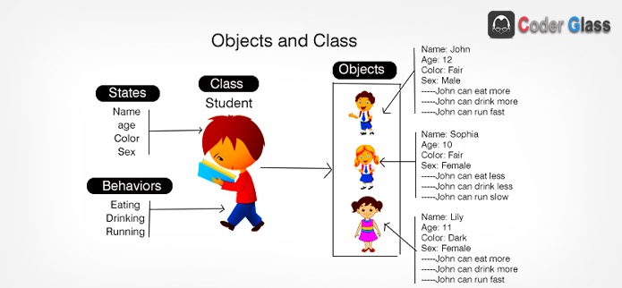
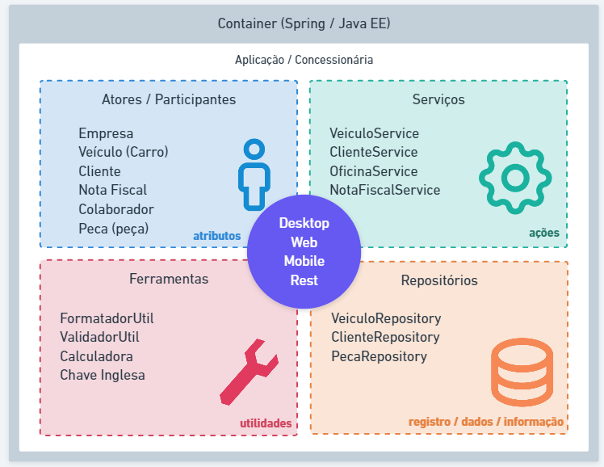

# Conceitos de Java POO

Com o decorrer da evolução da programação surgiram termos como linguagens de **Alto nível** e **Baixo nível**, mas o que seria isso?

## Linguagens de baixo nível

As lingaugens de baixo nível são linguagens mais próximas da linguagem de máquina, são exemplos desse tipo de linguagem o ***Assembly*** e ***C***.

## Linguagens de alto nível

As lingaugens de alto nível são linguagens mais próximas da lingaugem humana usando um conceito de sintaxe(forma de escrever processos para serem interpretados por um computador), são exemplos dessas linguagens o ***Java***, ***JS***, ***Python*** e ***C++***.
**Exemplos Assembly vs Python**

    #Assembly Hello, world!
    selection   .text

        global  _start

    _start: 

        mov edx, len  

        mov ecx, msg  

        mov ebx, 1 

        mov eax, 4  

        int 0x80   

        mov eax, 1 

        int 0x80   

        section .data

    msg db 'Hello, world!',0xa

    len equ $ - msg

---

    #Python Hello, world!
    print('Hello, world!')

## Os paradigmas de programação

### Programação estruturada

A **Programação Estruturada** é o paradigma de programação que visa melhor clareza, qualidade e tempo de produção de um programa de computador, fazendo uso extensivo de intruções de fluxo extruturado de seleção *(if, then, else)* e repetição *(while, for)*, além de estruturas de bloco e sub rotinas.

Devemos ter em mente que nesse paradigma implementamos estruturas sequenciais chamados de *procedimentos lineares* podendo afetar as varáveis de escopo local ou global em uma aplicação.

A programação estruturada é focada em procedimentos e funções.

### Programação orientada a objetos

A **Programação Orientada a Objetos** é um paradigma baseado no conceito de *"objetos"* que pode conter dados na forma de *campos* conhecidos como ***atributos*** e códigos na forma de *procedimentos* conhecidos como ***métodos***.

Nesse paradigma temos uma maior aproximação do cenario real onde temos tudo ao nosso redor sendo representado como *Objeto*.

A programação orienteda a objetos é focada em classes e objetos.

## Classes

Antes de entendermos melhor o que são os objetos precisamos criar um molde onde serão criadas as suas características e esse molde se chama **Classe**.

Toda a estrutura de código da lingaugem Java é distribuida em arquivos **.java** denominados de **Classes**.

As classes existentes em nosso projeto serão compostas por:

* **Identifícadores**
* **Características**
* **Comportamentos**

***Entendendo mais***

* Classes *(class)*: Estrutura e ou representação que direciona a criação de objetos do mesmo tipo.
* Identificador *(identity)*: Propósito existencial aos objetos que serão criados.
* Características *(states)*: Também conhecido como *Atributos* ou *Propriedades*, é toda a informação que representa o estado do objeto.
* Comportamentos *(behavior)*: Também conhecido como *Ações* o *Métodos* é toda a parte comportamental que um objeto dispõe.
* Instanciar *(new)*: é o ato de criar um objeto a partir de uma estrutura definida em uma classe.

**Ex:**

### Convenções de classes

* **Classe modelo *(model)*:** Classes que representam estruturas de dominio da aplicação como: Cliente, Nota Fiscal, Pedido e etc.
* **Classe de Seviço *(service)*:** Classes que contém regras de negócio e validação do nosso sistema.
* **Classe de Repositório *(repository)*:** Classes que contem uma integração com o banco de dados.
* **Classe de Controle *(controller)*:** Classe que possui a finalidade de disponibilizar alguma comunicação externa à nossa aplicação, tipo http web ou webservices.
* **Classe Utilitária *(util)*:** Classe que possi recursos comuns a toda a nossa aplicação.

**Ex:**

## Pacotes

A lingaugem Java é compostas por milhares de classes com as mais diversas finalidades, como: Classes de tipos de dados, apresentação de textos, números, datas, arquivos e diretórios, conexão a bancos de dados entre outras. Imaginar todas essas classes em um único nível de documentos parece complicado, e ainda mais quando adcionamos nossas próprias classes.

Mas é por isso mesmo que a linguagem disponibiliza de recurso para organizar as classes padrão e as criadas por nós, e esse recurso é o nosso pacote *(package)*.
Os pacotes são subdiretórios a partir do diretório src do nosso projeto onde estão localizadas as classes da linguagem e as novas que forem criadas para o projeto. Existem algumas convenções para a criação de pacotes já utilizadas no mercado.

### Nomeclatura

Suponha que você tem uma empresa chamada de **Power Soft** e essa empresa irá desenvolver um software *comercial*, *governamental* e *software livre* ou de *código aberto*. Temos os pacotes sugeridos para esse padrão apresentados abaixo:

* **Comercial:** com.powersoft
* **Governamental:** gov.powersoft
* **Código aberto:** org.powersoft

Como apresentado acima podemos ver uma padronização para o uso dos nomes de pacotes, mas podemos organizar um pouco mais as classes mediante a proposta de sua existencia.

* **model:** Classe que apresenta a camada de modelo da aplicação: Cliente, Pedido, Nota Fiscal e etc.
* **repository:** Classe ou interfaces que tem a finalidade de interagir com as tabelas do banco de dados: ClienteRepository.
* **service:** Classe que contêm as regras de negócio do sistema: ClienteService que possui um metodo com a finalidade de validar o CPF do cliente cadastrado.
* **controller:** Classe coma finalidade de disponibilizar nosso recurso da aplicação para outras apluicações via protocolo HTTP.
* **view:** Classe que possui alguma iteração com a interface gráfica acessada pelo usuário.
* **util:** pacote que contém classes utilitárias do sistema, como: FormatadorNumeroUtil, ValidadorUtil e etc.

### Identificação

Uma das características de uma classe é sua identificação como por exemplo *'Cliente'* porêm quando essa classe é organizada por pacotes ela passa a ter duas identificações. nome simples (**Cliente**) e nome qualificado (**com.powersoft.acesso.model.Cliente**), como podemos ver o nome qualificado apresenta o nome do pacote e todos os diretórios anteriores que nos permitem chegar até ele.

### Package vs Import

A localização de uma classe é definida pela palavra reservada ***package*** uma classe só contém uma definição de um package dentro do arquivo, sempre na primeira linha de código. Já para a utilização de uma classe em outros pacotes precisamos realizar a importação das mesmas usando a palavra reservada ***import*** como podemos ver abaixo.

    package <localização da classe>

    import <localização da classe a ser importada de outro pacote>
    import <localização da classe a ser importada de outro pacote>

    public static class MinhaClasse{

    }
